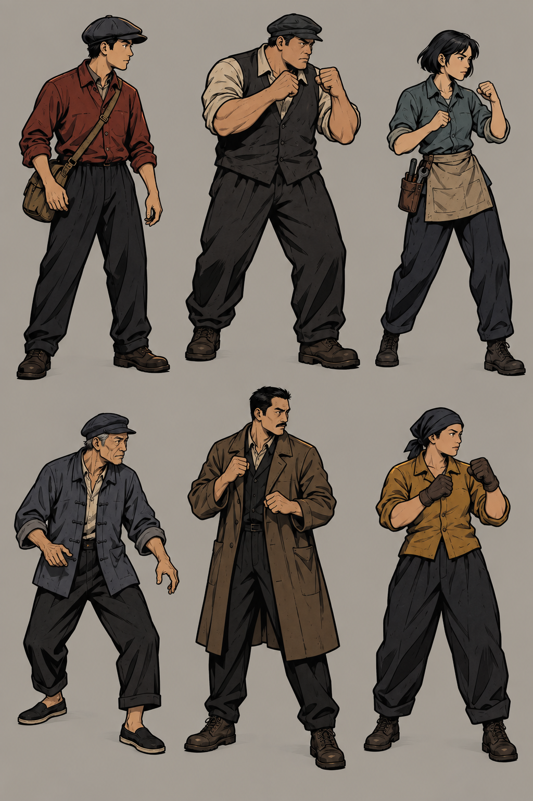

# 旧埠人物首轮：六种造型与近身互搏

用户已明确要求：增加一批人物，沿用 Fallen Aces 方向的二维漫画表达，可以拳击互搏。此要求更新了之前“仅一名互动人物、暂不加战斗”的小样范围。人物为架空旧埠原创设计，不复刻游戏里的角色。

随后已确认：主角第一人称，首轮玩家与 NPC 对打。六人图是候选 NPC 阵容，不自动把其中一人指定为主角；第一人称手部另行设计，见[表现与制作交接](first-person-brawling-v0.3.md)。

本轮完成六人造型比较图，尚未选定具体角色，也不是透明独立精灵、动画图集或已实现的战斗系统。采用内置 ImageGen，以项目已选人物近景为画法参照；[完整提示与来源](../../../art/characters/harbor-roster-v1.prompt.json)。



## 从左到右、先上后下

| 设计 ID | 身份提案 | 轮廓与配色 | 生活姿态与动作表现重点 |
| --- | --- | --- | --- |
| courier | 送货人 | 瘦长身形，铁锈红衬衣、鸭舌帽、贴身挎包 | 等待时看向来路；抬拳时挎包保持贴胯，拳不被身体遮住 |
| porter | 搬运工 | 宽肩厚臂，浅衬衣、深背心和粗靴 | 搬货或休息时重心低；抬手形成紧凑防守，出拳前肩部变化清楚 |
| electrician | 电工 | 利落短发，灰青上衣、短围裙、小腰袋 | 平时靠设备工作；转身戒备时手与工具袋分离，不用工具攻击 |
| boatman | 船工 | 偏瘦年长成人，灰蓝短衣、软帽、低鞋 | 微弯站姿，侧身看船；抬手与后撤有明显重心变化 |
| watchman | 仓库看守 | 高瘦、棕色长外套，暗色内搭 | 巡看时轮廓竖直；出拳时外套开口仍能读出躯干，不靠长衣掩盖动作 |
| cargo_worker | 货运女工 | 敦实身形、赭黄短衣、头巾与工作手套 | 工作时站姿稳，戒备时拳套与脸部留出负空间，受击时肩腰错动 |

图中宽肩搬运工额外出现了帽子，属于首轮输出可讨论的造型，不宣称完全等同提示。六人全身、手脚均可见，整体有共同线条与大明暗块；尚需在暗色场景里检查轮廓清晰度，以及动作中的身份一致性。

## 同一套 Schema 怎样承载

- SceneDesign.elements：人物造型、服装表面、二维表现与环境融合，新增按需 performance 表达动作形态。
- visual_groups：分别安排人物在工作口、会面平台、船边的视觉作用；人物不作为不可交互的贴墙装饰。
- experience/encounters：安排玩家与 NPC 何时发生互搏、谁参与、在哪里以及如何结束。首轮不包含 NPC 彼此对打，不预设所有工人都敌对。
- VisualProductionPlan：本图是阵容造型探索。选定人物后，近看研究保持脸、服装与体型一致，继续研究戒备、出拳、受击和恢复的关键姿态；实际图像数量根据需要安排。
- 后续资产制作：分别准备玩家第一人称拳头、对手的独立透明人物及动作图、朝向策略、落地与命中反馈。造型图不裁成六张就宣称具备动画。

## 一个人物的 performance 填写示例

```json
{
  "everyday": "搬运工站在工作廊侧边，双肩放松，偶尔侧头看门内，不持续举拳。",
  "actions": [
    {
      "name": "直拳",
      "preparation": "重心先稳住，后侧肩略收，拳抬到胸颊之间。",
      "key_pose": "出拳手从身体轮廓外侧伸向对手，另一拳留在脸旁，肩与腰产生明确转动。",
      "recovery": "出拳臂收回，重新形成可辨认的双拳戒备。"
    }
  ],
  "reactions": "受击时头肩先偏离，躯干随后失衡；是否恢复、退开或倒地由具体玩法决定，不一直保持站姿滑动。",
  "view_readability": "正看与斜看都要分清出拳手、护脸手和头部；浅袖口与深背心形成区别，不能靠高频衣褶识别动作。"
}
```

示例表达美术动作意图。具体拳速、距离、伤害、打断和敌对逻辑属于后续实现设计。
