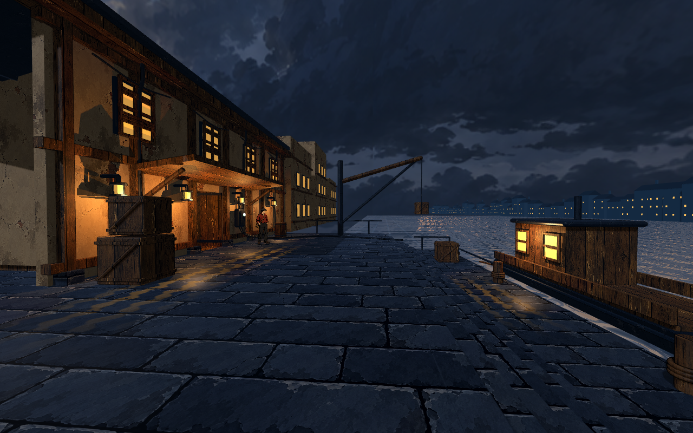
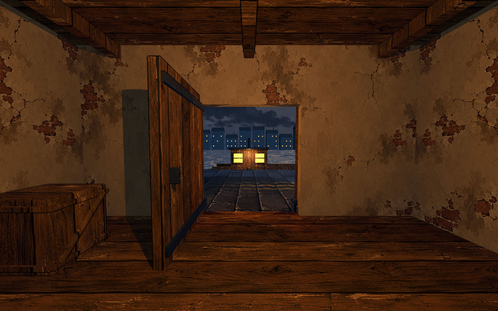
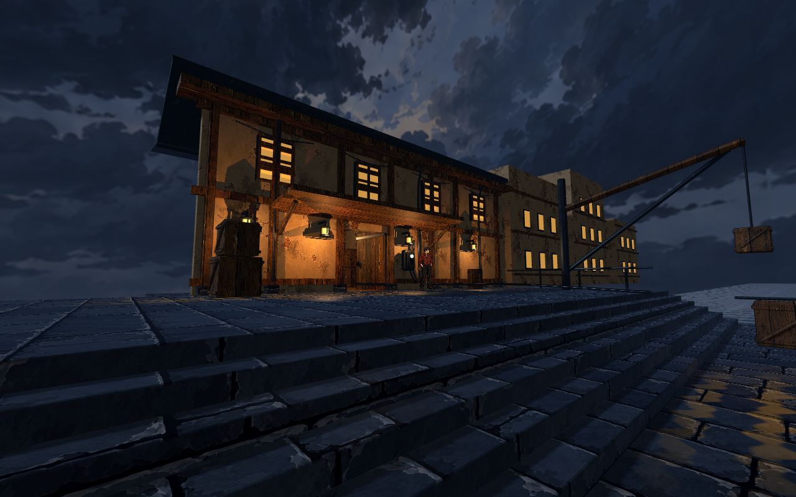

# 码头小样：运行与视觉记录

2026-09-10。可试玩，视觉匹配尚未通过。当前保留 round 01 的较好版本，未将生成目标图当成运行结果。

## 启动和操作

双击项目根目录 `启动码头小样.command`；依赖本机 `/Applications/Godot.app/Contents/MacOS/Godot`。
WASD 行走，鼠标观察，Shift 加速，E 开关门或让人物点头，R 重置，Esc 释放/捕获鼠标。靠近可交互对象后瞄准它，中心小点变金色。场景与截图没有文字标识。

默认旧街区场景保留。码头独立入口为 `game/scenes/harbor.tscn`，主要运行代码为 `game/scripts/harbor.gd`。

## 设计交接

- [SceneDesign](../../.scratch/scene-design/harbor/scene-design.json)：本次码头空间、主要物件、体验的主方案。
- [VisualProductionPlan](../../.scratch/scene-design/harbor/visual-production-plan.json)：三个相机视点与三帧体验安排，已回写实际机位。
- [ImageGen 目标图](../../art/harbor/target.png)及[完整提示与输入记录](../../art/harbor/target-prompt.json)：视觉参照，不是运行证据。
- [Blender 源文件](../../art/harbor/harbor.blend)：经 Blender MCP 执行 `tools/blender/make_harbor.py`，导出 `game/assets/harbor/harbor.glb`。
- [资产生图记录](../../art/harbor/asset-prompts.json)：人物、石材、灰泥、金属、天空；当前木纹复用 `game/assets/generated/wood.png`。第二轮新木纹保留在 `game/assets/harbor/wood.png`，回退后未使用，提示见 `art/harbor/wood-prompt.json`。

SceneDesign 决定空间与美术意图；本轮 dream-loop 消费该方案和视点进行实现与画面对照。未新增一套重复描述场景的交接 Schema，也未改动全局 dream-loop skill。

## 实际运行三帧

三图来自同一 Godot 场景；这是离散视点记录，不是连续行走录像。





室内外连接和台阶高差可见。补充视点也暴露了尚未完成的美术：室内陈设单薄，回望时建筑侧面与周边环境缺乏丰富层次。

## 检查与限制

本机 Godot 4.7.2，Compatibility / Apple M4 Pro；Blender 4.5.13 LTS。

[自动行走检查](playtest.log)全部通过：E 关门、关门阻挡、E 开门、正常移动穿门进入仓库、E 人物互动、无跳跃下台阶、无跳跃上台阶。这使用真实玩家控制器、物理帧和模拟按键，不能替代人的手感试玩。

[性能记录](performance.log)：1280×800，固定主机位运行 8 秒、略去前 2 秒，帧率中位数 276.55，10 分位 270，达到本轮至少 30 FPS 的目标。未做完整路线压力测试。三张最终截图均保存成功，导入及截图日志未报错误。

复查命令（从项目根目录运行）：

```sh
/Applications/Godot.app/Contents/MacOS/Godot --headless --path game --scene res://scenes/harbor.tscn -- --harbor-test
/Applications/Godot.app/Contents/MacOS/Godot --path game --scene res://scenes/harbor.tscn --resolution 1280x800 -- --render-test
```

本轮刻意简化：人物单张固定朝向 billboard，用手工暖色调与接触阴影融合；台阶用连续碰撞斜坡实现行走；水面与湿地高光是着色器近似，不是完整场景反射；远岸仅作背景；船不可登乘。没有战斗、航行、音效或完整人物动画。

## 视觉迭代结果

| 轮次 | 分数 | 结果 |
|---|---:|---|
| [00](judge-00.md) | 5.6/10 | 构图接近，水面、湿石和材质差距明显 |
| [01](judge-01.md) | 6.3/10 | 水面、远岸和局部湿地有所改善，仍未达到 8 分目标 |
| [02](judge-02.md) | 6.0/10 | 更换木纹与反射方法后，水面呈网格、地面呈涂漆条纹，出现退步 |

第二轮属于反射方法与材质来源的较大调整，仍然退步，触及 dream-loop 的 Stalled 退出条件。已恢复第一轮实现并重新截图、运行检查；第二轮截图和评审留作比较。当前最高 6.3 分是独立代理对目标图接近程度的判断，不代表用户审美认可。

待用户看图判断：整体码头氛围是否值得保留，再决定继续提高材质与灯光，还是调整建筑造型和场景构图。尚未宣布美术完成。
